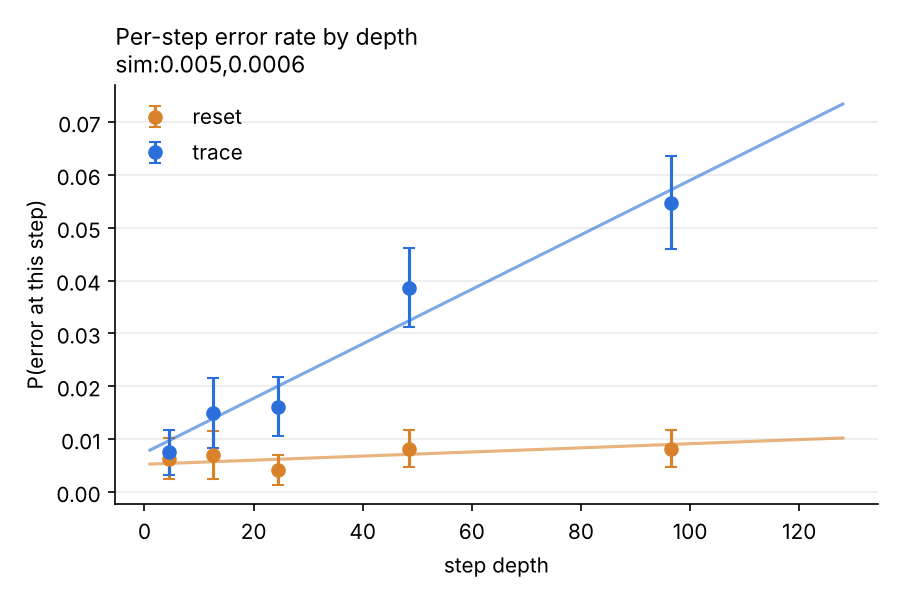
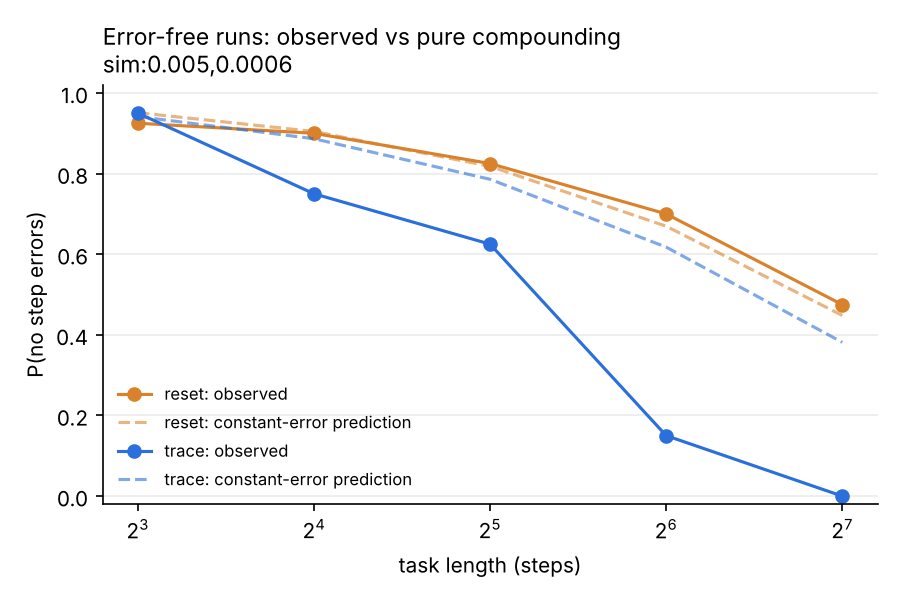

# horizon-decay

**When LLMs fail at long tasks, is it compounding error or context degradation?**

Evan Prawda · October 2026 · status: harness validated on simulated models; real-model runs in progress

---

## The question

The next phase of the frontier is models doing long, multi-step work as agents. It is well documented that success falls off as tasks get longer. What is less settled is *why*. Two explanations predict the same headline curve but call for very different fixes:

| | **H1: compounding** | **H2: context degradation** |
|---|---|---|
| Claim | Each step has the same small error rate; long tasks fail because those errors multiply. | Each step gets harder the deeper the model is in its own context, even when the step itself is identical. |
| Per-step error vs depth | flat | rising |
| Effect of resetting context | none | per-step error returns to its shallow level |
| What it implies for agents | improve per-step accuracy and verification | invest in memory and context management (summarize-and-reset loops, external state) |

This repo is built to tell the two apart.

## Design

**Task.** Five registers (A–E) hold digits. The model applies N operations in order: add a constant mod 10, copy one register to another, or swap two. Every operation has the same difficulty at every depth, and values never grow. So if error rises with depth, the cause is depth, not harder steps. Ground truth is computed exactly, and tasks are generated from fixed seeds.

**Three conditions, identical tasks:**

- `trace`: one call. The model sees all N ops and writes the full state after every step. Context grows with depth.
- `reset`: the same ops, fed in chunks of k (default 8). Each call sees only the model's *own* last state plus the next k ops. Context stays short at any depth.
- `direct`: one call, final answer only. A baseline for how much writing out steps helps.

**Key measurement: local step error.** Each step is scored against the model's *own* previous state, not the true one. That separates the error made at step *i* from errors inherited earlier, so it gives a per-step error rate at every depth, even after a mistake. With that we:

1. Fit `P(error at step d) = base + slope·(d−1)` per condition, with 95% bootstrap CIs that resample whole trials.
2. Compare observed error-free runs against `(1 − h)^N`, where h is the shallow-depth error rate. Falling below the curve means errors are arriving faster than pure compounding predicts.
3. Compare `trace` vs `reset` at the *same absolute depth*. This is the causal test.

**Reading the result:** a positive slope in `trace` that disappears in `reset` supports H2. Flat slopes in both support H1. A positive slope in both would mean something else rises with depth, such as fatigue in long outputs, and would call for a follow-up.

## Validation: can the analysis recover a known answer?

Before spending money on real models, the pipeline was run on two simulated models with *known* behavior. The simulators read the same prompts and write output that goes through the same parser and scorer as real models.

| simulated model | true slope | `trace` estimated slope (95% CI) | `reset` estimated slope (95% CI) |
|---|---|---|---|
| pure compounding (H1) | 0 | −0.00002 [−0.00006, 0.00002] | 0.00002 [−0.00003, 0.00006] |
| context degradation (H2) | 0.0006 | 0.00052 [0.00041, 0.00062] | 0.00004 [−0.00002, 0.00010] |

The analysis recovers the true slope, separates the two mechanisms, and does not invent a slope where there is none.




Full simulated output: [`results/sim/summary.md`](results/sim/summary.md).

## Real-model results

*Pending.* Results will be added here per model, with raw trial files in `results/`.

## Run it

**Easiest: Colab.** Open [`notebooks/run_on_colab.ipynb`](notebooks/run_on_colab.ipynb), add your API key as a Colab secret, set the model ID, and run all cells.

**Locally:**

```
git clone https://github.com/ev-prawda92/Horizon-Decay.git
cd Horizon-Decay
pip install -e ".[anthropic,openai,dev]"
pytest
export ANTHROPIC_API_KEY=your-key
python -m horizon.run --model anthropic:MODEL_ID --lengths 8 16 32 64 128 --trials 30 --out results/MODEL_ID/trials.jsonl
python -m horizon.analyze results/MODEL_ID/trials.jsonl --out results/MODEL_ID
```

Model specs: `anthropic:<model-id>`, `openai:<model-id>`, or `sim:<base>,<slope>` for the simulator. Runs append to the output file, so an interrupted run can be resumed by running the remaining lengths.

**Cost.** At the defaults (5 lengths × 30 tasks × 3 conditions), one model writes roughly 350k output tokens. That's a few dollars to low tens of dollars depending on the model; check current pricing. Start with `--trials 10` to sanity-check.

## Repo layout

```
horizon/tasks.py     task generator, exact ground truth
horizon/prompts.py   prompts for trace / reset / direct
horizon/models.py    Anthropic, OpenAI and simulated clients
horizon/parse.py     tolerant output parsing
horizon/run.py       experiment runner (JSONL, one line per trial)
horizon/analyze.py   fits, bootstrap CIs, figures, summary.md
tests/               unit tests, including parameter recovery
notebooks/           Colab notebook
results/sim/         validation run on simulated models
```

## Limitations and threats to validity

- **Synthetic task.** Register tracking is a clean probe of state maintenance. It is not a real agent workflow, so effects may differ in size on real tasks.
- **Output length and context depth are tied together in `trace`.** Deeper steps also come after more generated text. `reset` removes both at once. Separating input context from output length would need a further condition, such as supplying the earlier steps as given input rather than model output.
- **Reasoning models.** Models that think before answering may do the tracking in hidden reasoning, so the written trace may not show where the error first happened. Report these separately, and treat `direct` as the cleaner comparison for them.
- **Linear fit.** The depth effect may not be linear. The binned plot is the primary evidence; the slope is a summary.
- **Format failures** are counted as unscorable steps and reported (`unparsed`), not counted as errors.
- **Sampling.** Current Anthropic SDKs no longer accept a temperature setting, and some OpenAI models allow only their default. Those runs use the provider's default sampling, which adds trial-to-trial noise; each trial records the setting it used (`sampling`). This adds variance but not bias, because conditions are compared on identical tasks under identical settings.

## Related work

- METR's work on measuring AI task-completion time horizons: how long a task models can reliably finish, and how that grows over time.
- Dziri et al. (2023), *Faith and Fate: Limits of Transformers on Compositionality*: errors compounding in multi-step reasoning.
- Liu et al. (2023), *Lost in the Middle*: how models use information depending on its position in long contexts.

This project asks a narrower question than those: at a fixed per-step difficulty, does the per-step error rate itself change with depth, and does a context reset undo it?

## License

MIT
